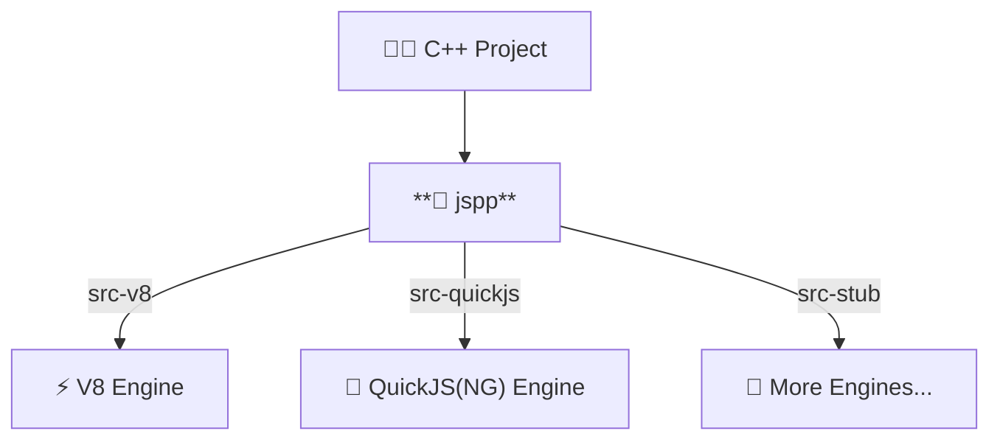

# jspp 🚀

**[English](./README.md)** | **[简体中文](./README_ZH.md)**

---

**jspp** is a modern C++ wrapper library for JavaScript engines. Its design is deeply inspired by `pybind11`, aiming to completely eliminate the tedious "glue code" required when integrating C++ with JavaScript.

With jspp, you can expose C++ classes, STL containers, and smart pointers to JavaScript in an elegant and safe way, without directly dealing with the complex low-level concepts of various JavaScript engines (such as V8's handles, isolates, contexts, or QuickJS's reference counting).



## ✨ Features

- **🔄 Multiple backend support**: Supports `V8` and `QuickJS` engines, with plans to support more backends in the future.
- **⛓️ pybind11-style Fluent API**: Declare JS bindings in pure, clean C++ using `defClass` and `defEnum`.
- **🔁 Seamless Type Conversions**: Out-of-the-box support for `std::vector`, `std::unordered_map`, `std::optional`,
  `std::variant`, `std::string`, and more.
- **🤖 Smart Pointers & Lifetimes**: Full support for `std::shared_ptr`, `std::unique_ptr`, `std::weak_ptr`.
- **🛡️ Advanced Memory Management**: Powerful `ReturnValuePolicy` system (kCopy, kReference, kTakeOwnership,
  kReferenceInternal) to prevent memory leaks and Use-After-Free.
- **🧬 OOP Support**: Native support for single/multiple inheritance, polymorphism (RTTI downcasting), and
  interface/abstract classes.
- **🛡️ Callback Safety**: `std::function` mapping with `TransientObjectScope` ensures safe JS-to-C++ callbacks without
  closure escape crashes.

## 🚀 Quick Start

Register a C++ class to the JS world in just a few lines of code:

```cpp
#include "jspp/core/Engine.h"
#include "jspp/core/EngineScope.h"
#include "jspp/binding/MetaBuilder.h"

// 1. Define your C++ class
class Pet {
    std::string name;
public:
    Pet(std::string name) : name(std::move(name)) {}
    std::string getName() const { return name; }
    void setName(std::string n) { name = std::move(n); }
    std::string bark(int times) { return name + " barked " + std::to_string(times) + " times!"; }
};

// 2. Create bindings using pybind11-style API
using namespace jspp::binding;
auto PetMeta = defClass<Pet>("Pet")
    .ctor<std::string>()
    .prop("name", &Pet::getName, &Pet::setName)
    .method("bark", &Pet::bark)
    .build();

// 3. Run it in the Engine!
int main() {
    jspp::Engine engine;
    jspp::EngineScope scope(engine);

    // Register the bound class
    engine.registerClass(PetMeta);

    // Execute JavaScript code
    auto result = engine.eval(jspp::String::newString(R"(
        let dog = new Pet("Buddy");
        dog.name = "Max"; // Triggers setName
        dog.bark(3);      // Returns "Max barked 3 times!"
    )"));

    std::cout << result.asString().getValue() << std::endl;
    return 0;
}
```

## 🧠 Advanced: Return Value Policy

Like pybind11, jspp provides fine-grained lifetime control when passing complex objects from C++ to JS:

- 🤖 `kAutomatic` (Default: Automatically deduced based on reference, pointer, and value semantics)
- 🔗 `kReference` (C++ retains ownership, JS holds only a reference)
- 📦 `kCopy` (Copies a new instance for JS)
- 🎁 `kTakeOwnership` (JS takes ownership; the C++ object is destructed when JS GC triggers)
- 🔐 `kReferenceInternal` (Binds the child object's lifetime to the parent object, keeping it alive)

## 🔨 Building

| flag                | Allowed Values   | Default | Required | Description                                |
| ------------------- | ---------------- | ------- | -------- | ------------------------------------------ |
| `JSPP_BACKEND`      | `v8` / `quickjs` | `v8`    | Optional | Specifies the backend engine.              |
| `JSPP_EXTERNAL_INC` | N/A              | N/A     | Optional | Specifies additional header include paths. |
| `JSPP_EXTERNAL_LIB` | N/A              | N/A     | Optional | Specifies additional static library paths. |
| `JSPP_BUILD_TESTS`  | `ON` / `OFF`     | `OFF`   | Optional | Whether to build the test suite.           |

## ⚙️ Internals

### 🧱 Engine Abstraction Layer

#### Wrapped Types

| Wrapped Type       | v8 Type            | QuickJs Type | Script Type |
| ------------------ | ------------------ | ------------ | ----------- |
| `Local<Value>`     | `Local<Value>`     | `JSValue`    | any         |
| `Local<Null>`      | `Local<Primitive>` | `JSValue`    | `null`      |
| `Local<Undefined>` | `Local<Primitive>` | `JSValue`    | `undefined` |
| `Local<Boolean>`   | `Local<Boolean>`   | `JSValue`    | `Boolean`   |
| `Local<Number>`    | `Local<Number>`    | `JSValue`    | `Number`    |
| `Local<BigInt>`    | `Local<BigInt>`    | `JSValue`    | `BigInt`    |
| `Local<String>`    | `Local<String>`    | `JSValue`    | `String`    |
| `Local<Symbol>`    | `Local<Symbol>`    | `JSValue`    | `Symbol`    |
| `Local<Function>`  | `Local<Function>`  | `JSValue`    | `Function`  |
| `Local<Object>`    | `Local<Object>`    | `JSValue`    | `Object`    |
| `Local<Array>`     | `Local<Array>`     | `JSValue`    | `Array`     |
| `Global<T>`        | `Global<T>`        | `JSValue`    | `T`         |
| `Weak<T>`          | `Weak<T>`          | `JSValue`    | `T`         |

#### ⚠️ Backend Engine Differences

##### 🧩 QuickJs

The QuickJS backend uses the QuickJS-NG fork as the mainline support, which adds many missing C-APIs on top of QuickJS.

> **Note**: In QuickJS, due to the lack of a `JS_NewWeak` interface, `Weak<T>` behaves as a strong reference in the QuickJS backend. This means code using `Weak<T>` will **not** automatically break circular references in QuickJS; developers need to manage lifetimes manually to avoid memory leaks.

#### Scopes

| Scope                  | Description                                                                                                                                                                |
| ---------------------- | -------------------------------------------------------------------------------------------------------------------------------------------------------------------------- |
| `EngineScope`          | Engine scope; within this scope, script APIs can be safely called.                                                                                                         |
| `ExitEngineScope`      | Exits the engine scope and unlocks the engine.                                                                                                                             |
| `StackFrameScope`      | Script call stack frame scope. You probably won't need this; some backends (like V8) require it for explicitly escaping values.                                            |
| `TransientObjectScope` | Transient object scope, used to protect the lifetime of objects returned with `ReturnValuePolicy::kReference` / `kReferenceInternal`, preventing UAF from closure escapes. |

#### Exception Model

jspp implements a two-way exception model. Any `jspp::Exception` thrown within a jspp callback will be caught by jspp and rethrown as a script exception.

Conversely, exceptions thrown by scripts will be caught by jspp and rethrown as C++ `jspp::Exception`.

```cpp
void example() {
    auto engine = std::make_unique<jspp::Engine>();
    jspp::EngineScope scope{engine.get()};

    try {
        // Script -> C++
        engine->evalScript(jspp::String::newString("throw new Error('abc')"));
    } catch (jspp::Exception const& e) {
        e.what(); // "abc"
    }

    // C++ -> Script
    static constexpr auto msg = "Cpp layer throw exception";
    auto thowr  = jspp::Function::newFunction([](jspp::Arguments const& arguments) -> jspp::Local<jspp::Value> {
        throw jspp::Exception{msg};
    });
    auto ensure = jspp::Function::newFunction([](jspp::Arguments const& arguments) -> jspp::Local<jspp::Value> {
        assert(arguments.length() == 1);
        assert(arguments[0].isString());
        assert(arguments[0].asString().getValue() == msg);
        return {};
    });
    engine->globalThis().set(jspp::String::newString("throwr"), thowr);
    engine->globalThis().set(jspp::String::newString("ensure"), ensure);

    engine->evalScript(jspp::String::newString("try { throwr() } catch (e) { ensure(e.message) }"));
}
```

> **Note**: Due to the flexibility of script engines, almost any engine call can potentially throw an exception.
> Therefore, proper exception handling is essential when interacting with scripts.

#### Instance Objects

In jspp, all native objects constructed by script `new` use `InstancePayload` to manage information associated with the construction, including the engine, class metadata, constructor, instance object, etc.

All native object instances use `NativeInstance` for type-erased management, allowing developers to easily transfer smart pointers without worrying about lifetime issues.

> Objects created by script `new` have their lifetimes managed by the engine. Other objects are managed by the developer unless `ReturnValuePolicy::kTakeOwnership` is explicitly specified.

#### Trampoline

A trampoline is a mechanism for converting a script function into a C++ function, allowing script functions to be called from the C++ layer.

It is similar to pybind11's `trampoline`, but simpler and more lightweight.

```cpp
class Plugin {
public:
    virtual void bootsrap() = 0;
};
class PluginTrampoline : public Plugin, public jspp::enable_trampoline {
public:
    void bootsrap() override {
        JSPP_OVERRIDE_PURE(void, Plugin, "bootstrap", bootstrap /* , args... */);
    }
};
auto meta = jspp::binding::defClass<PluginTrampoline>("Plugin")
    .ctor()
    .implements<Plugin>() // Multiple inheritance; declare the implemented interface (class)
    .method("bootstrap", &PluginTrampoline::bootstrap)
    .build();
void main() {
    auto engine = std::make_unique<jspp::Engine>();
    jspp::EngineScope scope{engine.get()};
    engine->registerClass(meta);

    engine->globalThis().set(
        String::newString("test"), //
        Function::newFunction(cpp_func([](Plugin& plugin) {
            plugin.bootstrap();
        }))
    );

    engine->evalScript(jspp::String::newString(
        R"(
            class MyPlugin extends Plugin {
                bootstrap() {
                    console.log("Hello, World!");
                }
            };
            test(new MyPlugin()); // Hello, World!
        )"
    ))
}
```

### 📐 Binding Layer

#### Polymorphism Handling

In jspp, all polymorphic types are processed by `PolymorphicTypeHookBase` to obtain type information and perform dynamic casts, ensuring the pointer is at the most derived address.

If you need custom polymorphic conversion logic, you can specialize `PolymorphicTypeHook`.

```cpp
namespace jspp::binding::traits {
    template <>
    struct PolymorphicTypeHook<MyType> {
        static const void* get(const T* src, const std::type_info*& type) {
            // Convert pointer to MyType and set new type info
            // Then return the converted pointer
        }
    };
}
```

#### Return Value Policies

| Policy                         | Description                                                                                                                                                                                                                                                                                                                                                 |
| ------------------------------ | ----------------------------------------------------------------------------------------------------------------------------------------------------------------------------------------------------------------------------------------------------------------------------------------------------------------------------------------------------------- |
| `kAutomatic`                   | When returning a pointer, falls back to `ReturnValuePolicy::kTakeOwnership`; for rvalue and lvalue references, uses `ReturnValuePolicy::kMove` and `ReturnValuePolicy::kCopy` respectively. See below for specific behaviors. This is the default policy.                                                                                                   |
| `kCopy`                        | Creates a new copy of the returned object, owned by JS. Relatively safe because the lifetimes of the two instances are decoupled.                                                                                                                                                                                                                           |
| `kMove`                        | Uses `std::move` to move the content of the return value into a new instance owned by JS. Relatively safe because the lifetimes of the source (moved-from) and target (receiving) instances are decoupled.                                                                                                                                                  |
| `kReference`                   | References an existing object without taking ownership. The C++ side is responsible for the object's lifetime management and memory deallocation. (If C++ destroys an object still referenced and used by JS, it leads to undefined behavior.) When a `TransientObjectScope` exists, resources created with this policy are destroyed when the scope exits. |
| `kTakeOwnership`               | References an existing object (i.e., does not create a new copy) and takes ownership. When the object's reference count reaches zero, JS calls the destructor and delete operator. If C++ also performs the same destruction, or the data was not dynamically allocated, undefined behavior occurs.                                                         |
| `kReferenceInternal`           | If the return value is an lvalue reference or pointer, the parent object (the `this` parameter of the called method/property) is kept alive at least until the returned value's lifetime ends. Otherwise, falls back to `ReturnValuePolicy::kMove`. Its internal implementation is identical to `ReturnValuePolicy::kReference`.                            |
| `kReferencePersistent`         | Similar to `kReference`, but resources created with this policy are **not** affected by `TransientObjectScope`.                                                                                                                                                                                                                                             |
| `kReferenceInternalPersistent` | Similar to `kReferenceInternal`, but resources created with this policy are **not** affected by `TransientObjectScope`.                                                                                                                                                                                                                                     |

#### Type Conversions

| C++ Type                      | Script Type (`toJs`)                            | Script Input (`toCpp`)                                   |
| ----------------------------- | ----------------------------------------------- | -------------------------------------------------------- |
| `bool`                        | `boolean`                                       | `boolean`                                                |
| `NumberLike<T>`               | `int64`/`uint64` → `BigInt`<br>other → `number` | `BigInt`/`number` → `int64`/`uint64`<br>`number` → other |
| `StringLike<T>`               | `String`                                        | `String`                                                 |
| `std::is_enum_v<T>`           | `number`                                        | `number`                                                 |
| `std::optional<T>`            | `nullopt` → `null`<br>`T` → `T`                 | `null`/`undefined` → `nullopt`<br>`T` → `T`              |
| `std::vector<T>`              | `Array<T>`                                      | `Array<T>`                                               |
| `std::unordered_map<K, V>`    | `Object<K, V>` (`K` must be `StringLike<K>`)    | `Object<K, V>`                                           |
| `std::variant<T...>`          | `T`¹                                            | `T`                                                      |
| `std::monostate`              | `null`                                          | `null` / `undefined` (other types throw `TypeError`)     |
| `std::pair<T1,T2>`            | `[T1, T2]`                                      | `[T1, T2]`                                               |
| `std::function<R(Args...)>`   | `Function`                                      | `Function`                                               |
| `std::shared_ptr<T>`          | `T` (Script Instance)                           | `T` (Script Instance)                                    |
| `std::weak_ptr<T>`            | `T` (Script Instance)                           | `T` (Script Instance)                                    |
| `std::unique_ptr<T, Deleter>` | `T` (Script Instance)²                          | `T` (Script Instance)                                    |
| `std::reference_wrapper<T>`   | `T` (Script Instance)                           | `T` (Script Instance)                                    |
| `std::filesystem::path`       | `String`                                        | `String`                                                 |

> ¹ `std::variant` returns `null` in the `valueless_by_exception()` state.  
> ² Custom `Deleter` is currently not supported.

## 📜 License

This project is licensed under the [MIT License](LICENSE)
