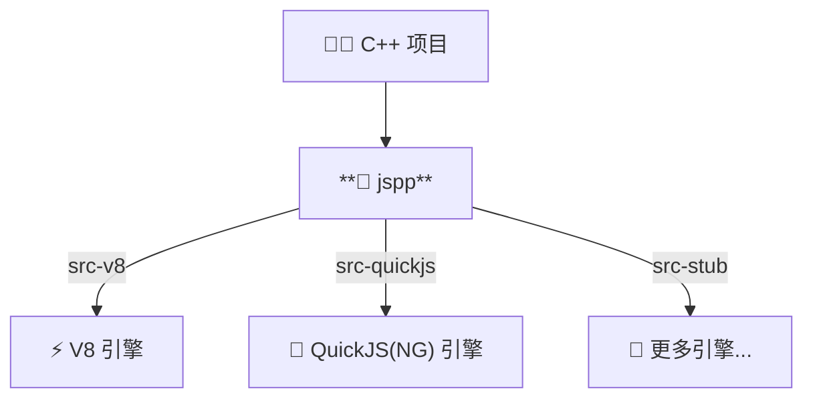

## jspp 🚀

**[English](./README.md)** | **[简体中文](./README_ZH.md)**

---

**jspp** 是一个基于现代化 C++ 开发的 JavaScript 引擎封装库。它的设计深度借鉴了 `pybind11`，旨在彻底消除在 C++ 与 JavaScript
集成时所需编写的繁琐“胶水代码”。

使用 jspp，你无需直接面对 JavaScript 各引擎复杂的底层概念（如 v8 的各种 Handle、Isolate、Context 或 QuickJs 的引用计数等），就能以极其优雅和安全的方式将 C++
类、STL 容器、智能指针暴露给 JavaScript。



## ✨ 核心特性

- **🔄多后端支持**: 支持 `V8` 和 `QuickJS` 引擎，未来计划支持更多后端。
- **⛓️类似 pybind11 的链式 API**：使用 `defClass` 和 `defEnum` 极速声明绑定关系。
- **🔁无缝类型转换**：开箱即用支持 `std::vector`, `std::unordered_map`, `std::optional`, `std::variant`, `std::string` 等。
- **🤖智能指针与生命周期**：完美兼容 `std::shared_ptr`, `std::unique_ptr`, `std::weak_ptr`。
- **🛡️内存管理策略**：强大的 `ReturnValuePolicy` (返回值策略) 系统（如 kCopy, kReference, kTakeOwnership,
  kReferenceInternal），避免内存泄漏和 UAF（悬垂引用）。
- **🧬面向对象支持**：原生支持继承链、多重继承、多态（RTTI 自动向下转型）及抽象类。
- **🛡️回调安全**：针对 `std::function` 提供了 `TransientObjectScope` 瞬态作用域保护，彻底阻断 JS 闭包逃逸导致的宿主崩溃问题。

## 🚀 快速开始

只需几行代码，即可将 C++ 类注册到 JS 世界：

```cpp
#include "jspp/core/Engine.h"
#include "jspp/core/EngineScope.h"
#include "jspp/binding/MetaBuilder.h"

// 1. 定义你的 C++ 类
class Pet {
    std::string name;
public:
    Pet(std::string name) : name(std::move(name)) {}
    std::string getName() const { return name; }
    void setName(std::string n) { name = std::move(n); }
    std::string bark(int times) { return name + " barked " + std::to_string(times) + " times!"; }
};

// 2. 像 pybind11 一样进行绑定
using namespace jspp::binding;
auto PetMeta = defClass<Pet>("Pet")
    .ctor<std::string>()
    .prop("name", &Pet::getName, &Pet::setName)
    .method("bark", &Pet::bark)
    .build();

// 3. 在引擎中运行！
int main() {
    jspp::Engine engine;
    jspp::EngineScope scope(engine);

    // 注册刚刚绑定的类
    engine.registerClass(PetMeta);

    // 执行 JavaScript 代码
    auto result = engine.eval(jspp::String::newString(R"(
        let dog = new Pet("Buddy");
        dog.name = "Max"; // 自动调用 C++ 的 setName
        dog.bark(3);      // 返回 "Max barked 3 times!"
    )"));

    std::cout << result.asString().getValue() << std::endl;
    return 0;
}
```

## 🧠 进阶：返回值策略 (Return Value Policy)

同 pybind11 一样，当 C++ 向 JS 传递复杂对象时，jspp 提供了精细的生命周期控制：

- `🤖 kAutomatic` (默认：根据引用、指针、值语义自动推导)
- `🔗 kReference` (C++ 保留所有权，JS 仅持有引用)
- `📦 kCopy` (拷贝一个新的对象给 JS)
- `🎁 kTakeOwnership` (JS 接管所有权，当 JS 触发 GC 时会自动析构 C++ 对象)
- `🔐 kReferenceInternal` (子对象的生命周期与父对象绑定，保活机制)

## 🔨 构建

| flag                | 允许值           | 默认值 | 依赖 | 描述                                     |
| ------------------- | ---------------- | ------ | ---- | ---------------------------------------- |
| `JSPP_BACKEND`      | `v8` / `quickjs` | `v8`   | 可选 | 指定后端引擎                             |
| `JSPP_EXTERNAL_INC` | N/A              | N/A    | 可选 | 指定要添加的头文件路径(例如 v8 预构建库) |
| `JSPP_EXTERNAL_LIB` | N/A              | N/A    | 可选 | 指定要添加的静态库路径(例如 v8 预构建库) |
| `JSPP_BUILD_TESTS`  | `ON` / `OFF`     | `OFF`  | 可选 | 是否构建测试集                           |

## ⚙️ 内部实现

### 🧱 引擎抽象层

#### 封装类型

| 封装类型           | v8 类型            | QuickJs 类型 | 脚本类型    |
| ------------------ | ------------------ | ------------ | ----------- |
| `Local<Value>`     | `Local<Value>`     | `JSValue`    | any         |
| `Local<Null>`      | `Local<Primitive>` | `JSValue`    | `null`      |
| `Local<Undefined>` | `Local<Primitive>` | `JSValue`    | `undefined` |
| `Local<Boolean>`   | `Local<Boolean>`   | `JSValue`    | `Boolean`   |
| `Local<Number>`    | `Local<Number>`    | `JSValue`    | `Number`    |
| `Local<BigInt>`    | `Local<BigInt>`    | `JSValue`    | `BigInt`    |
| `Local<String>`    | `Local<String>`    | `JSValue`    | `String`    |
| `Local<Symbol>`    | `Local<Symbol>`    | `JSValue`    | `Symbol`    |
| `Local<Function>`  | `Local<Function>`  | `JSValue`    | `Function`  |
| `Local<Object>`    | `Local<Object>`    | `JSValue`    | `Object`    |
| `Local<Array>`     | `Local<Array>`     | `JSValue`    | `Array`     |
| `Global<T>`        | `Global<T>`        | `JSValue`    | `T`         |
| `Weak<T>`          | `Weak<T>`          | `JSValue`    | `T`         |

#### ⚠️ 后端引擎差异

##### 🧩 QuickJs

在 QuickJS 后端中，默认使用 QuickJS-NG 分支作为主线支持，该分支在 QuickJS 基础上添加了大量缺失的 C-API。

> 在 QuickJs 中，由于没有 `JS_NewWeak` 接口，`Weak<T>` 在 QuickJS 后端中表现为强引用。
> 这意味着使用 `Weak<T>` 的代码在 QuickJS 后端**不会**自动打破循环引用，开发者需要手动管理生命周期，以避免内存泄漏。

#### 作用域

| 作用域                 | 描述                                                                                                                                      |
| ---------------------- | ----------------------------------------------------------------------------------------------------------------------------------------- |
| `EngineScope`          | 引擎作用域, 在引擎作用域内，可以安全地调用脚本 API。                                                                                      |
| `ExitEngineScope`      | 引擎退出作用域, 并 unlock 引擎                                                                                                            |
| `StackFrameScope`      | 脚本调用栈帧作用域，你应该用不到，在某些后端中例如v8需要此作用域显示逃逸值                                                                |
| `TransientObjectScope` | 瞬态对象作用域，用于保护 `ReturnValuePolicy::kReference` / `ReturnValuePolicy::kReferenceInternal` 对象的生命周期，避免闭包逃逸导致的 UAF |

#### 异常模型

在 jspp 中实现了双向异常模型，在 jspp 的 Callback 中抛出 `jspp::Exception` 都会由 jspp 捕获并抛出脚本异常，
反之，脚本抛出的异常也会由 jspp 捕获并抛出 `jspp::Exception` C++ 异常。

```cpp
void example() {
    auto engine = std::make_unique<jspp::Engine>();
    jspp::EngineScope scope{engine.get()};

    try {
        // Script -> C++
        engine->evalScript(jspp::String::newString("throw new Error('abc')"));
    } catch (jspp::Exception const& e) {
        e.what(); // "abc"
    }

    // C++ -> Script
    static constexpr auto msg = "Cpp layer throw exception";
    auto thowr  = jspp::Function::newFunction([](jspp::Arguments const& arguments) -> jspp::Local<jspp::Value> {
        throw jspp::Exception{msg};
    });
    auto ensure = jspp::Function::newFunction([](jspp::Arguments const& arguments) -> jspp::Local<jspp::Value> {
        assert(arguments.length() == 1);
        assert(arguments[0].isString());
        assert(arguments[0].asString().getValue() == msg);
        return {};
    });
    engine->globalThis().set(jspp::String::newString("throwr"), thowr);
    engine->globalThis().set(jspp::String::newString("ensure"), ensure);

    engine->evalScript(jspp::String::newString("try { throwr() } catch (e) { ensure(e.message) }"));
}
```

> 需要注意的是，由于脚本引擎的灵活性，几乎调用任何引擎都有可能抛出异常，因此在和脚本交互时，需要做好异常处理。

#### 实例对象

在 jspp 中，所有脚本 `new` 构造的native对象，其底层均使用 `InstancePayload` 托管本次 `new` 构造时的信息，包括引擎、类元信息、构造方、实例对象等。

所有原生对象实例都采用 `NativeInstance` 进行类型擦除托管，使得开发者可以方便的移交智能指针，而无需担心生命周期问题。

> 脚本 new 的对象由引擎负责生命周期，其它对象除非显式指定 `ReturnValuePolicy::kTakeOwnership`，否则均由开发者负责生命周期。

#### Trampoline

trampoline 是一种用于将脚本函数转换为 C++ 函数的机制，它允许脚本函数在 C++ 层面被调用。

它和 pybind11 的 `trampoline` 类似，但更简单，更轻量级。

```cpp
class Plugin {
public:
    virtual void bootsrap() = 0;
};
class PluginTrampoline : public Plugin, public jspp::enable_trampoline {
public:
    void bootsrap() override {
        JSPP_OVERRIDE_PURE(void, Plugin, "bootstrap", bootstrap /* , args... */);
    }
};
auto meta = jspp::binding::defClass<PluginTrampoline>("Plugin")
    .ctor()
    .implements<Plugin>() // 多继承，需要声明实现的接口(类)
    .method("bootstrap", &PluginTrampoline::bootstrap)
    .build();
void main() {
    auto engine = std::make_unique<jspp::Engine>();
    jspp::EngineScope scope{engine.get()};
    engine->registerClass(meta);

    engine->globalThis().set(
        String::newString("test"), //
        Function::newFunction(cpp_func([](Plugin& plugin) {
            plugin.bootstrap();
        }))
    );

    engine->evalScript(jspp::String::newString(
        R"(
            class MyPlugin extends Plugin {
                bootstrap() {
                    console.log("Hello, World!");
                }
            };
            test(new MyPlugin()); // Hello, World!
        )"
    ))
}
```

### 📐 绑定层

#### 多态处理

在 jspp 中，所有多态类型都经过 `PolymorphicTypeHookBase` 获取类型信息以及动态转换确保指针处于最顶层地址(Most Derived Address)。

如果您需要自行处理多态转换，您可以特化 `PolymorphicTypeHook` 以实现自定义的多态转换逻辑。

```cpp
namespace jspp::binding::traits {
    template <>
    struct PolymorphicTypeHook<MyType> {
        static const void* get(const T* src, const std::type_info*& type) {
            // 转换指针到 MyType 并设置新的类型信息
            // 然后返回转换后的指针
        }
    };
}
```

#### 返回值策略

| 策略                           | 描述                                                                                                                                                                                                                                         |
| ------------------------------ | -------------------------------------------------------------------------------------------------------------------------------------------------------------------------------------------------------------------------------------------- |
| `kAutomatic`                   | 当返回值为指针时，回退到 `ReturnValuePolicy::kTakeOwnership`；对于右值引用和左值引用，则分别使用 `ReturnValuePolicy::kMove` 和 `ReturnValuePolicy::kCopy`。各策略的具体行为见下文说明。这是默认策略。                                        |
| `kCopy`                        | 创建返回对象的新副本，该副本归 Js 所有。此策略相对安全，因为两个实例的生命周期相互解耦。                                                                                                                                                     |
| `kMove`                        | 使用 `std::move` 将返回值的内容移动到新实例中，新实例归 JS 所有。此策略相对安全，因为源实例（被移动方）和目标实例（接收方）的生命周期相互解耦。                                                                                              |
| `kReference`                   | 引用现有对象，但不取得其所有权。对象的生命周期管理及不再使用时的内存释放由 C++ 侧负责。(若 C++ 侧销毁了仍被 JS 引用和使用的对象，将导致未定义行为。)当存在 `TransientObjectScope` 时，此策略创建的资源会在 `TransientObjectScope` 退出时销毁 |
| `kTakeOwnership`               | 引用现有对象（即不创建新副本）并取得其所有权。 当对象的引用计数归零时，Js 会调用析构函数和 delete 运算符。 若 C++ 侧也执行同样的销毁操作，或数据并非动态分配，将导致未定义行为                                                               |
| `kReferenceInternal`           | 若返回值是左值引用或指针，父对象（被调用方法 / 属性的 this 参数）会至少保持存活至返回值的生命周期结束,否则此策略会回退到 `ReturnValuePolicy::kMove`。其内部实现与 `ReturnValuePolicy::kReference` 一致                                       |
| `kReferencePersistent`         | 此策略和 `kReference` 大致相同，唯一的不同是此策略创建的资源不受 TransientObjectScope 的影响。                                                                                                                                               |
| `kReferenceInternalPersistent` | 此策略和 `kReferenceInternal` 大致相同，唯一的不同是此策略创建的资源不受 TransientObjectScope 的影响。                                                                                                                                       |

#### 类型转换

| C++ 类型                      | 脚本类型(`toJs`)                               | 脚本输入(`toCpp`)                                       |
| ----------------------------- | ---------------------------------------------- | ------------------------------------------------------- |
| `bool`                        | `boolean`                                      | `boolean`                                               |
| `NumberLike<T>`               | `int64`/`uint64` → `BigInt`<br>其他 → `number` | `BigInt`/`number` → `int64`/`uint64`<br>`number` → 其他 |
| `StringLike<T>`               | `String`                                       | `String`                                                |
| `std::is_enum_v<T>`           | `number`                                       | `number`                                                |
| `std::optional<T>`            | `nullopt` → `null`<br>`T` → `T`                | `null`/`undefined` → `nullopt`<br>`T` → `T`             |
| `std::vector<T>`              | `Array<T>`                                     | `Array<T>`                                              |
| `std::unordered_map<K, V>`    | `Object<K, V>` (`K` 需为 `StringLike<K>`)      | `Object<K, V>`                                          |
| `std::variant<T...>`          | `T`¹                                           | `T`                                                     |
| `std::monostate`              | `null`                                         | `null` / `undefined` (其他类型抛出 `TypeError`)         |
| `std::pair<T1,T2>`            | `[T1, T2]`                                     | `[T1, T2]`                                              |
| `std::function<R(Args...)>`   | `Function`                                     | `Function`                                              |
| `std::shared_ptr<T>`          | `T` (脚本实例)                                 | `T` (脚本实例)                                          |
| `std::weak_ptr<T>`            | `T` (脚本实例)                                 | `T` (脚本实例)                                          |
| `std::unique_ptr<T, Deleter>` | `T` (脚本实例)²                                | `T` (脚本实例)                                          |
| `std::reference_wrapper<T>`   | `T` (脚本实例)                                 | `T` (脚本实例)                                          |
| `std::filesystem::path`       | `String`                                       | `String`                                                |

> ¹ `std::variant` 在 `valueless_by_exception()` 状态下返回 `null`。  
> ² 自定义 `Deleter` 暂不支持。

## 📜 许可证

本项目采用 [MIT 许可证](LICENSE)
